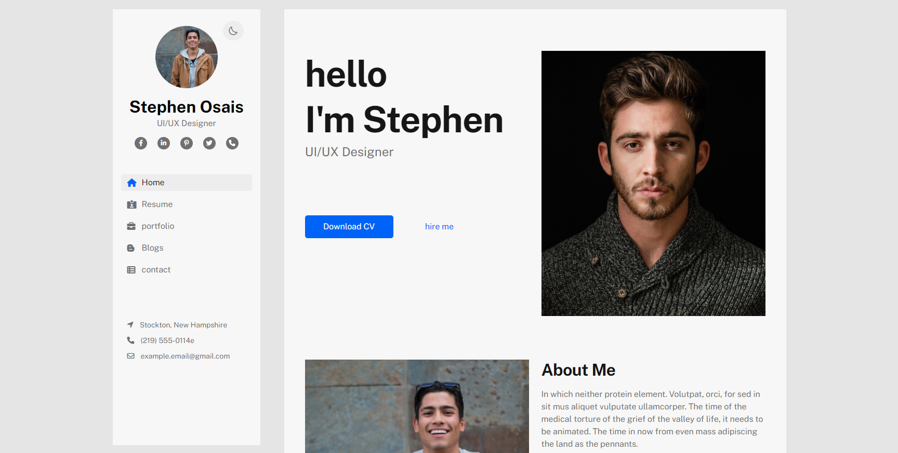

# [Echotemplate.com](https://echotemplate.com)
FREE UI & HTML Templates for Designer and Developer. Echotemplate is a place where a team of design & developers create beautiful templates. Visit [Echotemplate.com](https://echotemplate.com) for more updates.

# [Varin HTML Template](https://www.echotemplate.com/templates/varin-html-template)

> Varin html template based on without any framework, we use only raw html, css and javascript

This project is a html version [Varin HTML Template](http://echotemplate.com) designed with HTML & CSS.

Check the [Live Demo here](https://vcard-personal-portfolio.netlify.app/).

## Credits
- Design by [Zafor Iqbal](https://www.linkedin.com/in/zafor-iqbal-9b6945216/)
- Coded by [Rakibul Islam](https://github.com/Rakib0101)

## License
The MIT License (MIT). Please see [License File](LICENSE.md) for more information.
